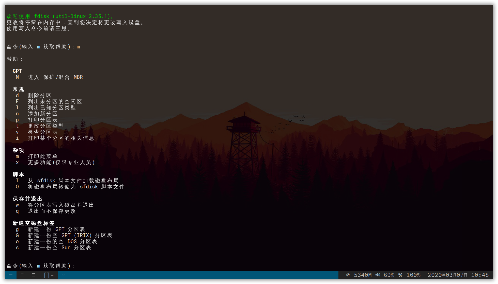

本文介绍了如何安装 Arch Linux，在安装前至少对计算机有些了解，了解分区的概念，使用过其他 Linux 发行版最佳，了解命令行基本命令的构成。

本文使用 Arch Liunx 原生的安装方式进行安装，并非 Manjaro 版本，纯命令行操作。且不包含图形化界面的安装。

## 关于本文的一些标记

若在命令中出现 `<` 、`>` 括住的内容，如

```bash
<hostname>
```

你要根据上下文，将其修改为你需要的内容，如

```bash
hao99
```

建议在每一步骤阅读完毕后再进行操作，像有些步骤会使用引用进行补充说明，如

> 示例：
>
> 该步骤若不是特殊键盘配列的使用者，跳过这一步


## 预备操作

要安装 Arch Linux，首先你得先准备一下以下的东西

- 一块没有用的硬盘分区09
- 一块 USB 闪存 或使用 DVD 进行刻录
- Arch Linux 的 ISO 安装镜像 [下载](https://www.archlinux.org/download/)
- 一台随时可看文档的设备 [文档](https://wiki.archlinux.org/index.php/Installation_guide)
- 至少得会用一个 Linux 下的文本编辑器，如 vim、nano （vim 若从未使用过，你可能连退出都不会！）
- 清醒的脑子

首先现将 Arch Linux 的 ISO 安装镜像刻录到 U 盘或 DVD 光盘中

> 若刻录到 U 盘，笔者这里推荐 Windows 平台下较为好用的刻录工具：[balenaEtcher](https://www.balena.io/etcher/)
>
> 笔者试过使用 UltraISO，在安装过程中出现过问题

重启系统，进入 BIOS，将 USB （DVD 光驱）设置为第一启动项


## 安装过程

#### 1. 字体设置

```bash
setfont /usr/share/kbd/consolefonts/LatGrkCyr-12x22.psfu.gz
```

#### 2. 键盘布局设置

```bash
loadkeys colemak
```

> 这一步是给使用特殊键盘配列的人使用的，若你使用的是 QWERT 配列，请跳过这一步

#### 3. 映射修改

```bash
vim keys.conf
```

向文件中加入

```bash
keycode 1  = Caps_Lock
keycode 58 = Escape
```

加载配置

```bash
loadkeys keys.conf
```

> 这一步是为了方便类似 Vim 的使用，进行模式切换的时候，使用 Caps_Lock 要比使用 Escape 按键顺手得多，且大小写大部分情况下都可通过 Shift 键完成，Caps_Lock 进行大小写切换的频率其实很小。
>
> 当然，不需要的可以直接跳过这一步

#### 4. 网络链接

查看可联网设备

```bash
ip link
```

开启选中联网设备

```bash
ip link set <DeviceName> up
```

扫描附近可连接的 WiFi（有线连接无需进行）

```bash
iwlist <DeviceName> scan | grep ESSID
```

生成 WiFi 连接配置文件（有线连接无需进行）

```bash
wpa_passphrase <WiFi SSID> <password> > internet.conf
```

使用刚刚生成的配置文件连接 WiFi（有线连接无需进行）

```bash
wpa_supplicant -c internet.conf -i <DeviceName> &
# & 符号表示在后台运行
```

分配 IP

```bash
dhcpcd &
```

测试联网状态

```bash
ping baidu.com # 网址随意
```

> 注意 Arch Liunx 进行安装的时候是必须需要进行联网的！
>
> 若无线 WiFi 模块无法驱动，可以考虑先进行有线连接安装，或者使用手机 USB 连接，进行热点共享。待系统安装完成后，再寻找驱动安装方法

#### 5. 更新系统时间

```bash
timedatectl set-ntp true
```

#### 6. 硬盘分区

> 有些教程可能会教你使用一个 GUI 工具来进行操作，其认为对新手门槛较低
>
> 首先我认为安装 Arch Liunx 的应该不会是纯新手，多少对命令行操作有过了解，而且使用命令行进行分区并不复杂

查看硬盘设备列表

```bash
fdisk -l
```

选中要编辑的硬盘

```bash
fdisk <DriveName>
# 例如 fdisk /dev/sda
```

---

显示分区信息 `p`

创建 GPT 分区表 `g`

新建分区 `n`

帮助信息 `m`

---

中文版：



---

具体可参考

| MOUNT POINT               | PARTITION | PARTITION TYPE        | SUGGESTED SIZE          |
| ------------------------- | --------- | --------------------- | ----------------------- |
| `/mnt/boot` or `/mnt/efi` | /dev/sdX1 | EFI system partition  | 260 ~ 512 MiB           |
| `/mnt`                    | /dev/sdX2 | Linux x86-64 root (/) | Remainder of the device |
| [SWAP]                    | /dev/sdX3 | Linux swap            | More than 512 MiB       |

分区完成确认无误后，使用 `w` 将其写入磁盘

格式化分区（退出 fdisk 后）：

```bash
mkfs.fat -F32 /dev/sdX1        # 将分区 1 格式化成 Fat32
mkfs.ext4 /dev/sdX2            # 将分区 2 格式化成 Ext4 或者你也可以使用较新的 XFS 格式
mkswap /dev/sdX3               # 将分区 3 格式化成 swap 分区格式

swapon /dev/sdX3
```

> 注意这里的分区操作要根据自己的需要进行操作，切忌直接复制命令
>
> 请先理解命令的意思，后根据自己的分区进行操作
>
> 格式化后的硬盘的文件会被清空，请确保没有有用的文件在目标分区！！！

#### 7. 修改为中国镜像源

```bash
vim /etc/pacman.d/mirrorlist
```

将 `## China` 的源移至文件顶部

> 笔者推荐将中科大或清华的源位于前列
>
> 这一步在国内也是必须做的，若不修改的话速度会相当慢，而且会有下载失败的风险

#### 8. 挂载分区

```bash
mount /dev/sdX2 /mnt

mkdir /mnt/boot

mount /dev/sdX1 /mnt/boot
```

> 这一步要注意，结构必须与上述代码一致，否则会安装失败
>
> 我的 sdX2 即是我要安装到的目标磁盘
>
> 我的 sdX1 是引导分区

#### 9. 正式开始安装

```bash
pacstrap /mnt base liunx linux-firmware
```

接下来等待其安装完成即可

#### 10. 安装完成后设置自动挂载

```bash
genfstab -U /mnt >> /mnt/etc/fstab
```

> 硬盘被手动挂载后都需要把挂载信息写入 /etc/fastab 这个文件中，否则下次开机启动时仍然需要重新挂载
>
> 系统开机会自动读取 /etc/fstab 这个文件的内容，根据文件里面的配置挂载硬盘，这样我们只需要将硬盘挂载信息写入这个文件中，我们就不需要每次开机启动之后手动进行挂载了

#### 11. 改变当前 root 为安装好后的 Linux 的 root

```bash
arch-chroot /mnt
```

若要退回 ISO 安装镜像的 root

```bash
exit
```

---

注意后面的操作会频繁来回切换 root，我会标注好指令是在哪个 root 下执行的

#### 12. 时区设置

*该操作在 安装好的 Liunx 的 root 下*

```bash
ln -sf /usr/share/zoneinfo/Asia/Shanghai /etc/localtime 
hwclock --systohc
```

> 在国内的时区都是一样的，我这边设置的是上海，你也可以设置成香港

#### 13. 本地化设置

*该操作在 ISO 安装镜像的 root 下*

```bash
vim /mnt/etc/locale.gen
```

取消以下语句的注释

```bash
en_US.UTF-8 UTF-8
```

如果你想生成中文的本地化，则把下面这个操作的注释也去掉

```bash
zh_CN.UTF-8 UTF-8
```

接着进入安装好的 Linux 的 root 下

```bash
arch-chroot /mnt
```

生成本地化文件

```bash
locale-gen
```

回到 ISO 安装镜像的 root 下

```bash
exit
```

打开 locale.conf 配置文件

```bash
vim /mnt/etc/locale.conf
```

文件写入

```bash
LANG=en_US.UTF-8
```

#### 14. 基本配置

*该操作在 ISO 安装镜像的 root 下*

```bash
vim /mnt/etc/vconsole.conf
```

填入以下内容

```bash
# 键盘配列修改为 colemak；QWERTY 配列用户无需添加
KEYMAP=colemak
# 调换 Escape 和 Caps_Lock
keycode 1  = Caps_Lock
keycode 58 = Escape
```

> 该操作和安装前一样，若没有特殊配列和调换按键的需求的，直接跳过这一步

#### 15. hostname 修改

*该操作在 ISO 安装镜像的 root 下*

```bash
vim /mnt/etc/hostname
```

写入你想使用的主机名

```bash
<hostname>
```

#### 16. host 修改

*该操作在 ISO 安装镜像的 root 下*

```bash
vim /mnt/etc/hosts
```

写入以下内容

```bash
127.0.0.1        localhost
::1              localhost
127.0.0.1        <hostname>.localdomain <hostname>
```

#### 17. 设置密码

*该操作在安装好的 Linux 的 root 下*

```bash
passwd
```

#### 18. 安装引导程序

```bash
的pacman -S grub efibootmgr intel-ucode os-prober
```

```bash
mkdir /boot/grub
grub-mkconfig > /boot/grub/grub.cfg
```

查看当前系统架构

```bash
uname -m
```

安装 grub

```bash
grub-install --target=x86_64-efi --efi-directory=/boot
```

#### 19. 安装基础程序

````bash
pacman -S neovim vi zsh wpa_supplicant dhcpcd
````

#### 20. 尽情使用吧 ~