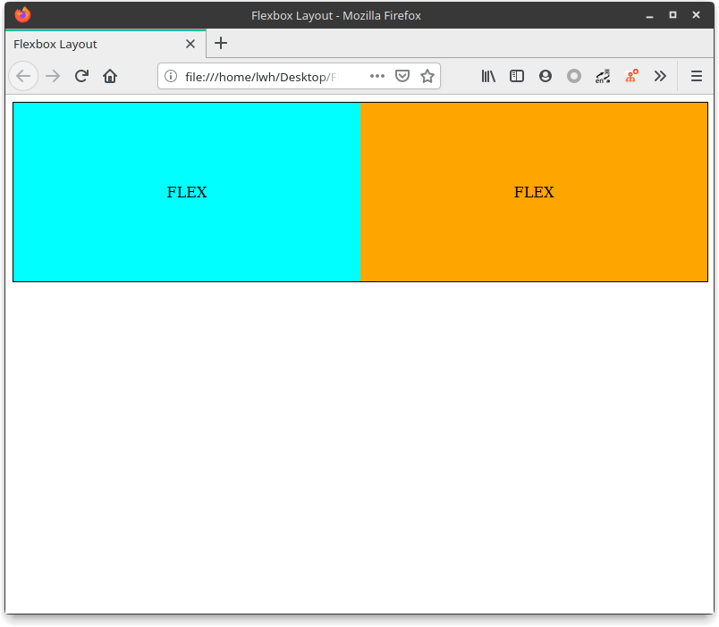
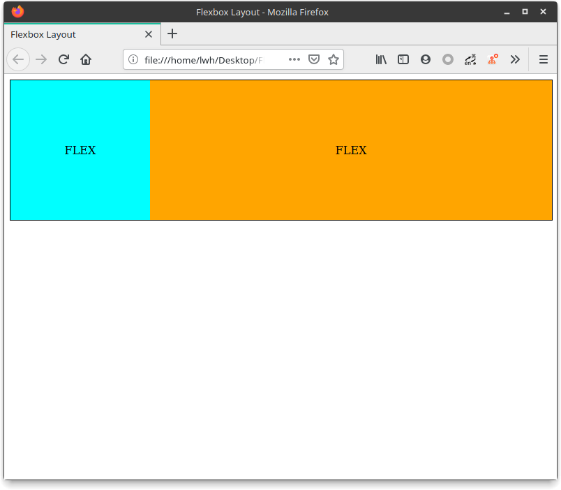

## 作CSS 布局之 flexbox 布局

#### 简介

flexbox 是弹性盒子的意思，盒子本来就是并列的，只需要指定宽度即可

#### 使用方式

HTML

```html
<div class="container">
    <div class="flex1">
        FLEX
    </div>
    <div class="flex2">
        FLEX
    </div>
</div>
```

CSS

```css
.container {
    width: 100%;
    height: 200px;
    display: flex;            /* 设置显示为 flex 样式 */
    border: 1px solid black;
}
.flex1 {
    text-align: center;
    line-height: 200px;
    background-color: aqua;
    flex: 1;                  /* 设置弹性盒子的比重 */
}
.flex2 {
    text-align: center;
    line-height: 200px;
    background-color: orange;
    flex: 1;                  /* 设置弹性盒子的比重 */
}
```

效果图



---

`flex` 属性有点像 Android 的 LinearLayout 里面的 weight 属性，是根据比重来进行自适应。如上图设定的就是 1 : 1 的大小，如果想设置成 2 : 1，将 `flex1` 类里面的 `flex` 属性改为 2 即可

效果图


---

除了像上面这样修改比重，也可以将宽度直接写死

```css
.flex1 {
    text-align: center;
    line-height: 200px;
    background-color: aqua;
    flex: none;        /* 将该容器 flex 设为 none */
    width: 200px;      /* 设置宽度 */
}
```

效果图



#### 优点

使用方式非常简单直观，也是目前常用的布局方法之一，Apple 官方网站就使用了这种方式

#### 缺点

现在这种布局方式并没有成为主流的原因是，老旧的浏览器不兼容，而且较新的浏览器，兼容的 flexbox 布局的版本也较为多样。

> 源代码：https://repo.hao99.club/HAo99/CSS-Layout