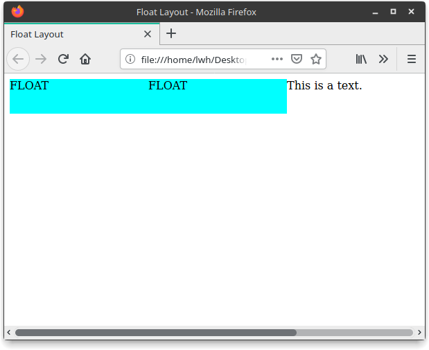
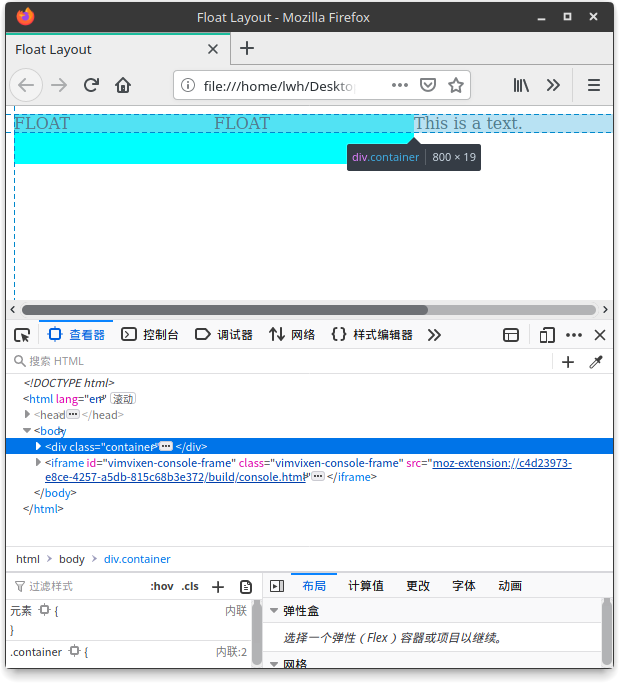
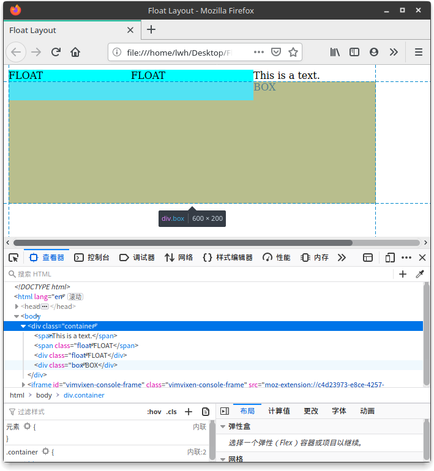
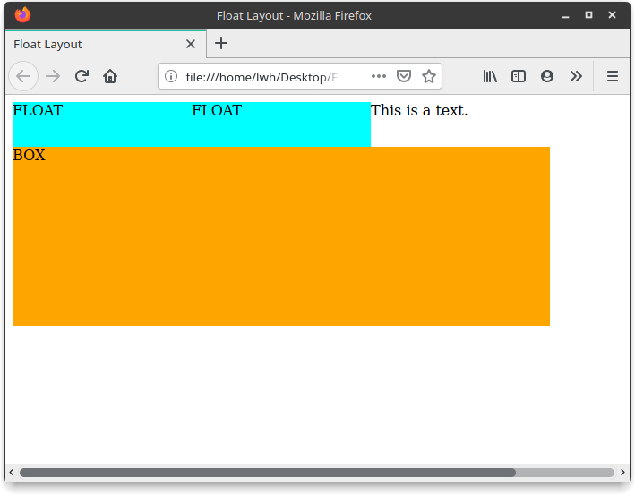

## CSS 布局之 float 布局

#### 简介

float 即元素浮动，会使元素脱离文档流，但不脱离文本流。是一种最复杂最难理解的一种方式，其一开始并不是设计用于布局，但是目前却是最主流的布局方式，主要是它的兼容性较好。

对自身的影响：

- 形成 “块”（BFC）
- 位置尽量靠上
- 位置尽量靠左/右（取决 float 属性）

对父级元素的影响：

- 在布局上 “消失”
- 高度塌陷

#### 使用方式

HTML

```html
<div class="container">
    <span>This is a text.</span>
    <span class="float">
        FLOAT
    </span>
    <div class="float">
        FLOAT
    </div>
</div>
```

CSS

```css
.container {
    width: 500px;
}
.float {
    background-color: aqua;
    float: left;        /* 设置向左浮动 */
    width: 200px;
    height: 50px;
}
```

效果图


---

由上图可见，位于左边的 `<span>` 设置了左浮动之后，它变成了块（宽高可被调整），而位于右边的 `<div>` 设置了左浮动之后，根据尽量靠上和尽量靠左的原则，它跑到了 `This is a  text` 文本的下方。

其实如果当容器足够宽，是能够将其放置第一行，下面将容器扩大

```css
.container {
    width: 800px;
}
```

效果图



---

其实上面这种做法会导致一个问题，就是**高度坍塌**！

效果如图



可以看见容器大高度只有那个没有浮动的文字的高度，并不包括那 2 个浮动元素，如果我们再向里面添加元素的话

HTML

```html
<div class="container">
    <span>This is a text.</span>
    <span class="float">
        FLOAT
    </span>
    <div class="float">
        FLOAT
    </div>
</div>
<!-- 新增 -->
<div class="box">
    BOX
</div>
```

CSS

```css
.box {
    width: 600px;
    height: 200px;
    background-color: orange;
}
```

效果图



可以看见我们新增的 `BOX` 部分内容还在浮动元素的里面，而且 `BOX` 中的文字也被挤到了旁边

---

上面这种结果并不是我们想要的，所以我们要进行**清除浮动**，有下面几种方法：

方法一：通过向容器添加如下属性

```css
.container {
    width: 800px;
    overflow: hidden;
}
```


方法二：向容器添加伪元素 ::after

```css
.container::after {
    content: "";
    height: 0px;
    display: block;
    clear: both;
}
```


方法三：将容器的高度直接与容器内的浮动对象占有的高度一致

```css
.container {
    width: 800px;
    height: 50px;
}
```


效果图



可见下面的 `BOX` 以及移动在浮动元素下方，正常显示

#### 优点

是目前最主流的布局方式，易于兼容老式浏览器，也能够进行自适应，较为灵活。

#### 缺点

最复杂、最难理解的布局方式，而且要注意很多问题，如高度塌陷，其设计之初并不是用于布局


> 源代码：https://repo.hao99.club/HAo99/CSS-Layout