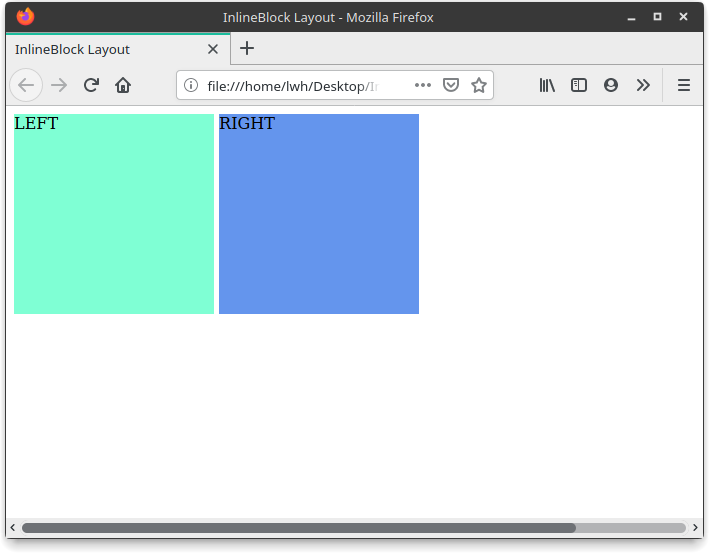
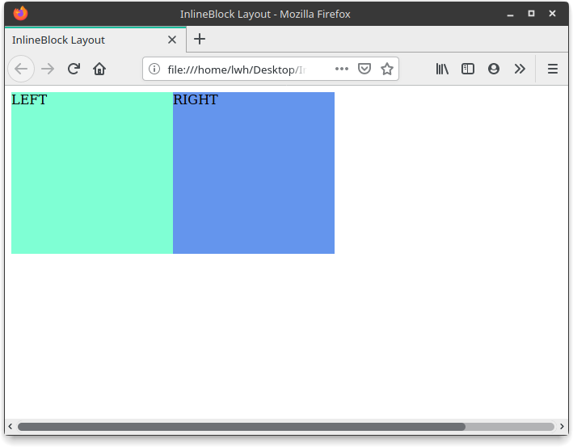

## CSS 布局之 inline-block 布局

#### 简介

inline-block 是一种较为简单的布局方式，可以像文本一样排列 `block` 元素，没有清除浮动等问题，但是需要处理间隙

#### 使用方式

HTML

```html
<div class="container">
    <div class="left">
        LEFT
    </div>
    <div class="right">
        RIGHT
    </div>
</div>
```

CSS

```css
.container {
    width: 800px;
    height: 200px;
}
.left {
    background-color: aquamarine;
    display: inline-block;    /* 设置 display 为 inline-block */
    width: 200px;
    height: 200px;
}
.right {
    background-color: cornflowerblue;
    display: inline-block;    /* 设置 display 为 inline-block */
    width: 200px;
    height: 200px;
}
```

效果图



---

可以看见上图两个元素之间是有一个间隙，这是因为单词与单词之间是有一个空格的间隔，成为 `inline-block` 之后，这两个元素就相当于两个单词，其间隙为空格。

消除间隙有以下两种方法：

方法一：设置容器字体为 0px

```css
.container {
    width: 800px;
    height: 200px;
    font-size: 0px;    /* 设置字体大小 */
}
```

但同时子元素的文字也消失了，需要手动设置子元素的字体大小

```css
.left {
    background-color: aquamarine;
    display: inline-block;
    width: 200px;
    height: 200px;
    font-size: 16px;    /* 设置字体大小 */
}
.right {
    background-color: cornflowerblue;
    display: inline-block;
    width: 200px;
    height: 200px;
    font-size: 16px;    /* 设置字体大小 */
}
```


方法二：消除 `<div>` 之间的间隔

```html
<div class="container">
    <div class="left">
        LEFT
    </div><!--
    --><div class="right">
        RIGHT
    </div>
</div>
```


效果图



#### 优点

使用简单，易于理解，需要做的处理工作较少，比较适合宽度固定的情景

#### 缺点

无法做响应式的自适应布局


> 源代码：https://repo.hao99.club/HAo99/CSS-Layout