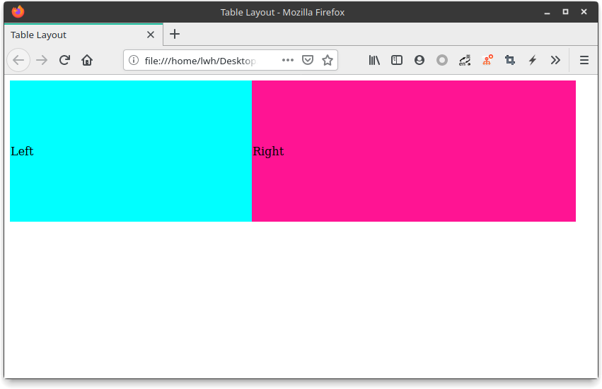
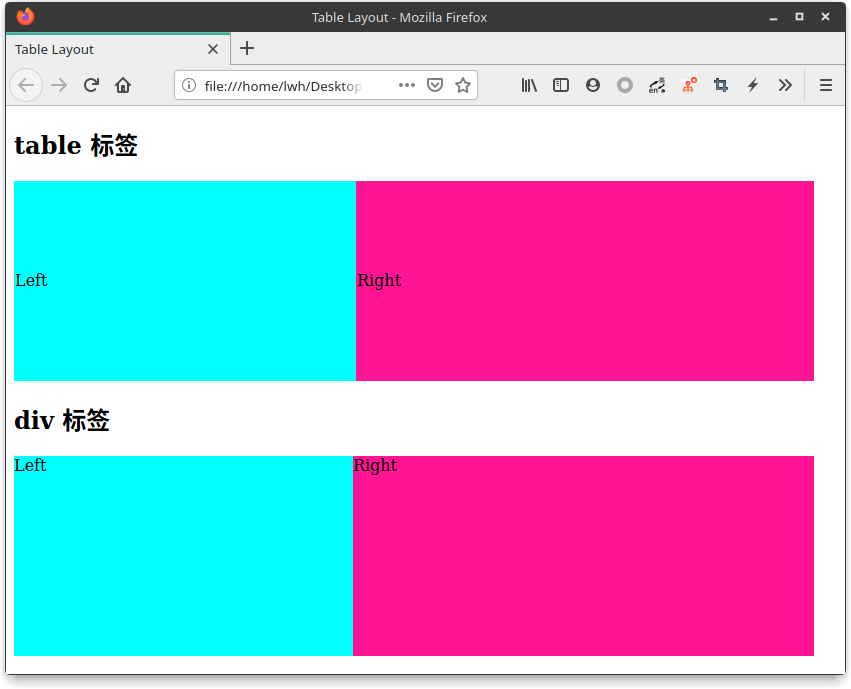

## CSS 布局之 table 布局

#### 使用方式

HTML

```html
<table>
    <tr>
        <td class="left">
            Left
        </td>
        <td class="right">
            Right
        </td>
    </tr>
</table>
```

CSS

```css
.left {
    background-color: aqua;
}
.right {
    background-color: deeppink;
}
table {
    width: 800px;
    height: 200px;
    border-collapse: collapse;    /* 去除单元格边框 */
}
```

效果图：



---

这种布局方式相当简单，只需要设定好表格的结构，通过 `border-collapse: collapse;` 属性将表格的边框去除即可。

当然每个单元格的大小也可以通过设置 `width` 和 `height` 属性达到想要的效果。

除了像正常表格一样使用 `<table>`、`<tr>`、`<td>`  标签外，还可以使用 `<div>` 标签，通过样式实现

---

HTML

```html
<div class="table">
    <div class="table-row">
        <div class="left table-cell">
            Left
        </div>
        <div class="right table-cell">
            Right
        </div>
    </div>
</div>
```

CSS

```css
.table {
    display: table;        /* 设置显示为表格样式 */
    width: 800px;
    height: 200px;
}
.table-row {
    display: table-row;    /* 设置显示为表格行样式 */
}
.table-cell {
    display: table-cell;   /* 设置显示为单元格样式 */
}
```

效果图作



---

可以看见与使用 `<table>` 标签基本无异，除了文字在 `<table>` 标签下是默认垂直居中的，若想要 `<div>` 标签下也垂直居中，只需要设置 `veritcal-align: center` 。

#### 优点

这种布局方式十分简单，也非常好理解，是早期布局的主流


> 源代码：https://repo.hao99.club/HAo99/CSS-Layout