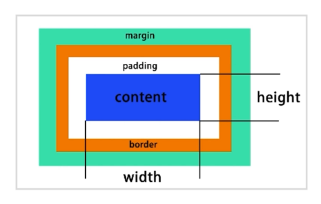
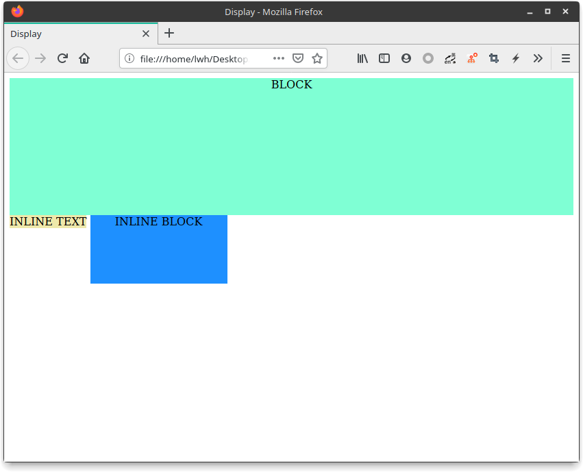
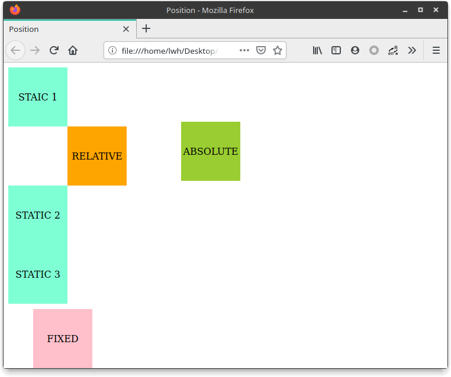

## CSS 布局

### 历史发展

- 早期以 table 为主
- 后来以技巧性布局为主 float / inline-block
- 现在有 flexbox / grid

### 常用布局方法

- table 表格布局
- float + margin 布局
- inline-block 布局
- flexbox 布局

### 基本概念

#### 盒子模型



通过上面这张图可以了解到：

- `width` 和 `height` 属性只对内容的宽高生效（这跟 Android 或是其他的一些布局是有区别的）
- `padding` 仅用于设置边框内到内容的留白
- `margin` 仅用于设置边框外到其他元素的留白

#### display 属性

确定元素的显示类型，常用的有以下这 4 个值

- block（块级元素）
- inline（行内元素）
- inline-block （内联块级元素）

**示例：**

HTML

```html
<div class="block">BLOCK</div>
<div class="inline">INLINE TEXT</div>
<div class="inline-block">INLINE BLOCK</div>
```

CSS

```css
.block {
    background-color: aquamarine;
    text-align: center;
    display: block;           /* 设置 display 为 block 块级元素 */
    height: 200px;
}
.inline {
    background-color: palegoldenrod;
    text-align: center;
    display: inline;          /* 设置 display 为 inline 內联元素 */
}
.inline-block {
    background-color: dodgerblue;
    text-align: center;
    display: inline-block;    /* 设置 display 为 inline-block 內联块级元素 */
    width: 200px;
    height: 100px;
}
```

效果图



---

可见将 `<div>` 的 `display` 设置为 `block` 时，该标签便成为一个块级元素，占据一整行，可以设置其内容的宽高；

设置为 `inline` 时，该标签便成为一个行内元素，与其它行内元素共占据一行，但是行内元素无法设置宽高；

设置为 `inline-block` 时，该标签便成为一个内联块级元素，既具有 `inline` 可与其他内联元素占据同一行的特性，又具有 `block` 可设定宽高的特性。

#### position 属性

- static （静态位置，默认）
- relative（相对位置）
- absolute（绝对位置）
- fixed（固定位置）

**示例：**

HTML

```html
<div class="static">
    STAIC 1
</div>
<div class="relative">
    RELATIVE
</div>
<div class="static">
    STATIC 2
</div>
<div class="absolute">
    ABSOLUTE
</div>
<div class="static">
    STATIC 3
</div>
<div class="fixed">
    FIXED
</div>
```

CSS

```css
.static {
    position: static;      /* 设置 position 为 static 静态位置 */
    text-align: center;
    line-height: 100px;
    height: 100px;
    width: 100px;
    background-color: aquamarine;
}
.relative {
    position: relative;    /* 设置 position 为 relative 静态位置 */
    text-align: center;
    line-height: 100px;
    height: 100px;
    width: 100px;
    background-color: orange;

    left: 100px;
}
.absolute {
    position: absolute;    /* 设置 position 为 absolute 静态位置 */
    text-align: center;
    line-height: 100px;
    height: 100px;
    width: 100px;
    background-color: yellowgreen;
    
    top: 100px;            /* 设置偏移上方 100px */
    left: 300px;           /* 设置偏移左方 300px */
}
.fixed {
    position: fixed;       /* 设置 position 为 fixed 静态位置 */
    text-align: center;
    line-height: 100px;
    height: 100px;
    width: 100px;
    background-color: pink;

    bottom: 0px;           /* 设置偏移底部 0px */
    left: 50px;            /* 设置偏移左边 50px */
}
```

效果图



---

- static 为标准文档流，垂直顺序排列
- relative 为相对位置，相对的是原位置（即 static 时所在的位置）作偏移
- absolute 为绝对位置，其相对父元素作偏移，而且可见代码中 `ABSOLUTE` 在 `STATIC 2` 与 `STATIC 3` 之间，但显示时 `STATIC 2` 与 `STATIC 3` 之间并没有间隔，说明该位置属性不占据空间

- fixed 为固定位置，其固定的是浏览器视图，无论滚动页面还是调整浏览器大小，都在浏览器视窗中向左偏移 50px 紧贴底部的位置

### 布局使用方式

- 

- 

- 

- 


> 源代码：https://repo.hao99.club/HAo99/CSS-Layout