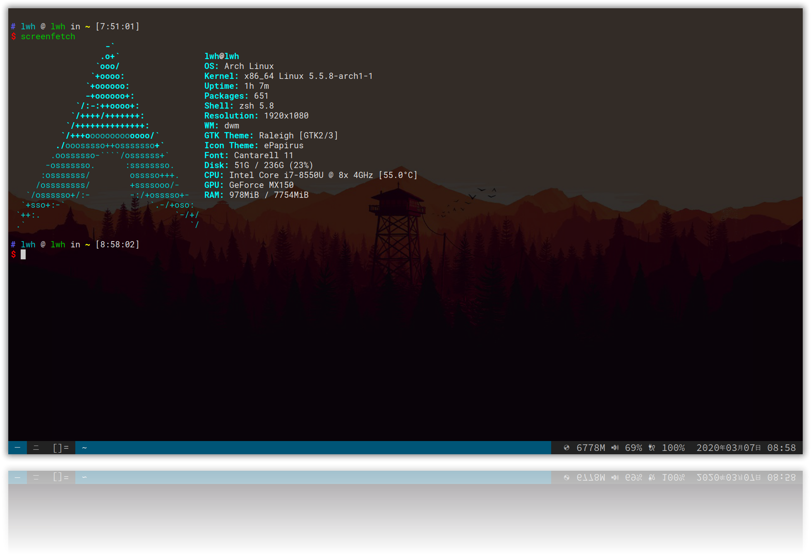

本文讲述了一下我是如何将笔记本从 macOS 转到 Arch Liunx + dwm，以及作出这个选择的原因。

<!-- more -->

### 思考

在刚刚放假的时候，我就打算将我的电脑进行重新整理配置。手头上有一台笔电和一台性能不错的台式机，目前的配置是：

**笔记本**：

- macOS （Hackintosh）

台式机：

- Windows 10
- macOS

而且为了改善这套配置，我购入了一条三星的 NVME 固态硬盘，以及 m2 硬盘盒。台式有雷电三接口，笔记本有满血的 Type-C，用于做系统盘肯定也是足够的。

思考了一下，目前什么是配置是最适合我的，从中得到以下几条：

- 笔记本的便携性可以让我随时随地都可以进行编码工作，但笔记本的触摸板体验其实不佳，在使用时经常需要拖拽操作来移动窗口，这也是笔记本操作的一大痛点
- 其次，笔记因为需要外出携带，长续航肯定是必要的
- 因为做后端开发，经常需要使用各种各样的 Web 服务器应用，例如 Nginx、Tomcat、ZooKeeper 等等，这些应用显然在 Linux 下进行部署是最好的

- 至于台式机，因为是在固定地方进行工作，而且搭配了较为舒适的机械键盘和鼠标，触控上和续航上其实都不需要太关心，即使不做变更，目前的配置也足够好用

得到以上结论后，恰好当时通过一些渠道认识到了 i3wm，我就已经决定好将笔记本配置为 Arch Linux + i3wm。

### 选择的原因

为什么选择 Arch Linux 而不是其他的一些发行版呢？首先是因为 Arch Linux 十分纯净，它把应用安装的选择权交给了用户，而不会强迫用户去使用某些软件，还有就是 Arch Linux 下的包管理器 Pacman 真的太香了，Ubuntu 的 apt-get 在安装一些软件的时候经常需要手动添加源，才能进行下载，Pacman 的软件资源可谓是太全了！更何况还有 aur 的加持。

而什么是 i3wm 呢，这是一种窗口管理器，而 Gnome、KDE Plasma、DDE 这些都是桌面环境，区别是桌面环境会提供除了窗口管理器以外，还有很多的组件，一般会附带很多配套的应用，而且消耗的资源也更加多。主要的交互方式都是键鼠配套。而窗口管理器，大多情况下的窗口排列都会自动帮你完成，还有小部分通过键盘进行操作，这样的话使用笔记本进行操作的效率就要提升很多了。

所以窗口管理器给我带来的是：

- 更长的续航
- 更高的使用效率

这样，上面的三项需求都被满足了。

### dwm 的出现

但是在进行实际安装前，我又被另一款窗口管理器吸引了，它的名字就是 dwm。

而它的优势又是什么呢？

dwm 是托管在一个 *致力于简约、清晰和节俭的极简自由软件项目的程序员社区* ——suckless.org，你无法想象这样一个窗口管理器**只用了不到两千行代码**，且使用 C 语言进行实现，而且所有的配置都是在源码直接进行修改，也就是说它连 IO 操作都没有，这能够说明其运行效率是变态级的快。 

### 安装

于是，我便开始进行了安装

首先是 Arch Linux：



其次是 dwm：



但可惜的是安装完成之后遇到了无法解决的问题，那就是 Idea 打开之后一片白屏，但移动到不同的位置，鼠标指针会发生变化，可以知道程序是在正常运行，但是显示出现了问题。当时因为这个问题无法解决，这是我常用的 IDE，这一点没有办法妥协，只好转向安装 i3wm。

i3wm 的安装：



时至今日，终于发现了解决方法，其实就在 Arch Linux 的官方文档就有提及，之前都是在 Google 和 Suckless 官网获取信息，没有注意到 Arch Liunx  的官方文档（背锅，这么重要的文档都没看），不得不说 Arch Liunx 的官方文档简直就是宝藏。

下面是解决方案：



至此，终于将系统配置到了暂时的最优解，亮个效果图吧：

更多相关的配置以后再补充，敬请期待~