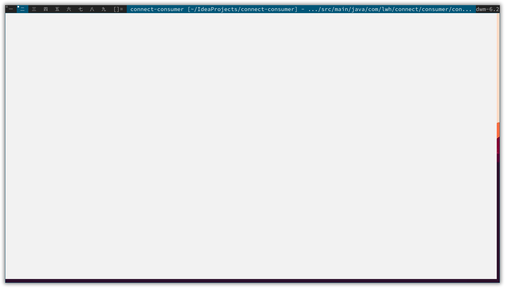
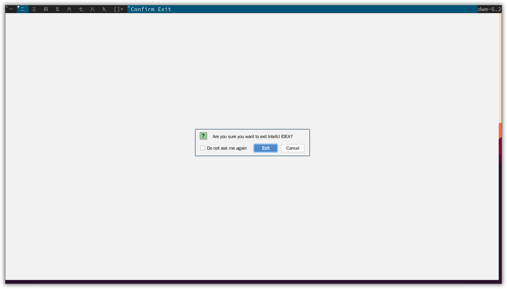
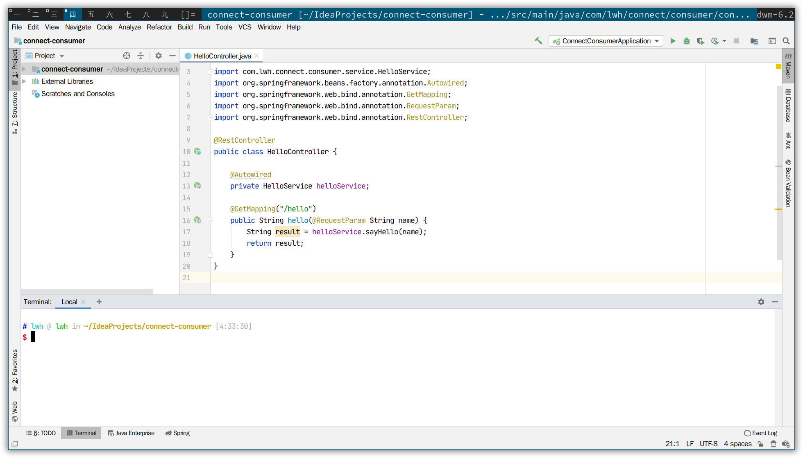

## 问题描述

安装完 dwm 之后，使用 JetBrains Toolbox 安装 Intellij IDEA、CLion、PyCharm 等应用，打开时出现如下状况：



一片白屏，光标移动到不同位置时会有变化，退出的时候对话框能够显示



### 问题原因

因为 dwm 不是 Java 的一个已知的窗口管理器，这会导致一些像鼠标释放使菜单消失、无法显示界面的问题。

### 解决方法

安装 wmname 程序

```bash
pacman -S wmname
```

使用 wmname 来设置一个 Java 能够识别的 WM 名称：

```bash
wmname LG3D
```

由于这个是暂时生效的，你可以将其写进 .xinitrc 里，或者通过 dwm 的 autostart 插件，添加至 .dwm/autostart.sh 里。

### 效果图



